  

 **Hi! I'm Azuma**

    
---

### 📊 Github Statistics

### :zap: Recent Activity

<!--START_SECTION:activity-->
`[02/14 22:15]`  Deleted `fix/biome-exclude-next` from [azuma317/open-japan-politech-platform](https://github.com/azuma317/open-japan-politech-platform) `[02/14 22:14]`  Deleted `feat/pnpm-catalog-version-mana...` from [azuma317/open-japan-politech-platform](https://github.com/azuma317/open-japan-politech-platform) `[02/14 22:05]`  Merged PR [`#16`](https://github.com/ochyai/open-japan-politech-platform/pull/16 '') in [ochyai/open-japan-politech-platform](https://github.com/ochyai/open-japan-politech-platform) `[02/14 22:05]`  Merged PR [`#15`](https://github.com/ochyai/open-japan-politech-platform/pull/15 '') in [ochyai/open-japan-politech-platform](https://github.com/ochyai/open-japan-politech-platform) `[02/14 12:43]`  Opened PR [`#16`](https://github.com/ochyai/open-japan-politech-platform/pull/16 '') in [ochyai/open-japan-politech-platform](https://github.com/ochyai/open-japan-politech-platform) `[02/14 12:43]`  Made `NaN` commits in [azuma317/open-japan-politech-platform](https://github.com/azuma317/open-japan-politech-platform) `[02/14 12:40]`  Created branch [`fix/biome-exclude-next`](https://github.com/azuma317/open-japan-politech-platform/tree/fix/biome-exclude-next) in [azuma317/open-japan-politech-platform](https://github.com/azuma317/open-japan-politech-platform) `[02/14 12:35]`  Opened PR [`#15`](https://github.com/ochyai/open-japan-politech-platform/pull/15 '') in [ochyai/open-japan-politech-platform](https://github.com/ochyai/open-japan-politech-platform) `[02/14 11:23]`  Created branch [`feat/pnpm-catalog-version-management`](https://github.com/azuma317/open-japan-politech-platform/tree/feat/pnpm-catalog-version-management) in [azuma317/open-japan-politech-platform](https://github.com/azuma317/open-japan-politech-platform) `[02/14 11:02]`  Forked [ochyai/open-japan-politech-platform](https://github.com/ochyai/open-japan-politech-platform) to [azuma317/open-japan-politech-platform](https://github.com/azuma317/open-japan-politech-platform)
<!--END_SECTION:activity-->

---