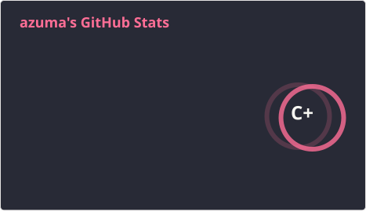

  

 **Hi! I'm Azuma**

    
---

### 📊 Github Statistics

### :zap: Recent Activity

<!--START_SECTION:activity-->
`[08/13 08:04]`  Made `undefined` commits in [azuma317/opennextjs-aws](https://github.com/azuma317/opennextjs-aws) `[08/13 08:03]`  Commented on [`#1197`](https://github.com/opennextjs/opennextjs-aws/issues/1197 'fix(converters): preserve query param encoding in getQueryFromSearchParams') in [opennextjs/opennextjs-aws](https://github.com/opennextjs/opennextjs-aws) `[08/13 08:03]`  Made `undefined` commits in [azuma317/opennextjs-aws](https://github.com/azuma317/opennextjs-aws) `[08/08 22:55]`  Starred repository [MengTo/Skills](https://github.com/MengTo/Skills) `[08/05 09:42]`  Merged PR [`#1865`](https://github.com/rorkai/App-Store-Connect-CLI/pull/1865 '') in [rorkai/App-Store-Connect-CLI](https://github.com/rorkai/App-Store-Connect-CLI) `[08/05 08:01]`  Opened PR [`#1865`](https://github.com/rorkai/App-Store-Connect-CLI/pull/1865 '') in [rorkai/App-Store-Connect-CLI](https://github.com/rorkai/App-Store-Connect-CLI) `[08/05 08:01]`  Forked [rorkai/App-Store-Connect-CLI](https://github.com/rorkai/App-Store-Connect-CLI) to [azuma317/App-Store-Connect-CLI](https://github.com/azuma317/App-Store-Connect-CLI) `[07/22 07:27]`  Starred repository [cloudflare/vinext](https://github.com/cloudflare/vinext)
<!--END_SECTION:activity-->

---